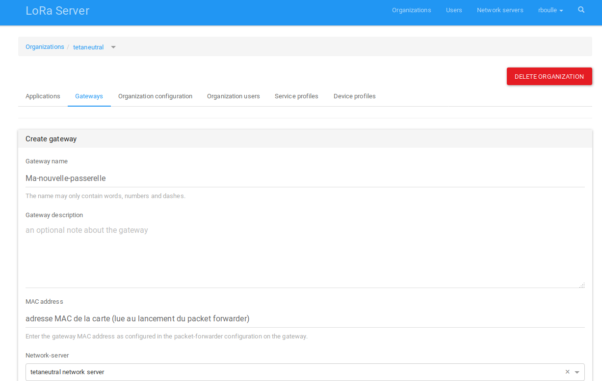

# ChisteraPi

C'est une passerelle LoRaWAN mono-canal basé sur Raspberry Pi et la carte ChisteraPi qui était commercialisée par Snootlab.

Ce matériel n'est plus utilisée et cette page plus maintenue.

## Configuration de base du Rpi

Récupérez la dernière raspbian :

https://downloads.raspberrypi.org/raspbian_latest

La décompresser puis « graver » l’image obtenue sur votre carte SD avec la commande suivante (à adapter bien sûr) :

 sudo dd bs=4M if=2017-09-07-raspbian-stretch.img of=/dev/sdb

!!! warning
    Parfois quelques soucis avec les adaptateurs de cartes SD...

Patienter jusqu’à ce que dd vous rende la main. Ensuite faite un :

```
 sync
```

afin d'être sûr que toutes les données dans les mémoires tampons soient écrites sur le disque.

!!! warning
    Par défaut, sur RaspberryPi, ssh n’est pas activé. Pour le faire ajoutez un fichier nommé ssh (sans extensions ni rien, vide ou pas) dans la partition boot de la carte SD. Plus d’informations ici : https://www.raspberrypi.org/blog/a-security-update-for-raspbian-pixel/


Insérez la carte SD dans le Raspberry et démarrez.

Pour retrouver l’IP du Raspberry, vous pouvez chercher dans l’interface de configuration de votre box Internet ou faire un :

    nmap -sn 192.168.0.0/24

qui va scanner votre réseau local. Vous devriez trouver l’IP attribuée à votre Raspberry.

Il suffit ensuite de s’y connecter en ssh avec :

    ssh pi@192.168.0.16

L'utilisateur par défaut est « pi ». Son mot de passe est raspberry (à changer par la suite). Faire les réglages habituels (dont « étendre le système de fichiers ») avec :

 sudo raspi-config

## Rpi en passerelle LoRaWAN sur IoT Tetaneutral.net

!!! warning
    À vérifier mais selon les specifications LoRaWAN, aucune gateway mono-canal ne peut être conforme à la norme...


* Activer le SPI (Serial Peripheral Interface, bus de données série selon un schéma maître-esclaves qui permet de communiquer avec le transmetteur) avec `raspi-config` via le menu "Interfacing Options".

* Installer la librairie WiringPi (normalement déjà installée dans raspbian). C'est une  librairie d'accès aux GPIO pour le microcontroleur BCM2835 utilisé sur le Raspberry Pi. Voir http://wiringpi.com pour plus d'informations. Installer aussi git :

    sudo apt-get install wiringpi git


* Récupérer les sources ici :

    git clone https://github.com/tftelkamp/single_chan_pkt_fwd

Dans le fichier `main.cpp`, remplacer `int ssPin=6;` par `int ssPin=10;`.

Puis, mettre l'IP et le bon port de Tetaneutral.net dans le fichier `main.cpp` :

``` c
#define SERVER1 "91.224.148.88" // [RB] IP de iot.tetaneutral.net
#define PORT 1700                   // [RB] The port on which to send data
```


Personnalisez ce qui est nécessaire (GPS, mail...), compilez et lancez le programme en root :

    sudo ./single_chan_pkt_fwd

Vous devriez obtenir un affichage comme le suivant :

``` c
SX1276 detected, starting.
Gateway ID: b8:27:eb:ff:ff:3d:c6:ca
Listening at SF7 on 868.100000 Mhz.
------------------
stat update: {"stat":{"time":"2017-11-11 19:45:26 GMT","lati":43.60733,"long":1.46987,"alti":189,"rxnb":0,"rxok":0,"rxfw":0,"ackr":0.0,"dwnb":0,"txnb":0,"pfrm":"Single Channel Gateway","mail":"mail@remiboulle.fr","desc":"rboulle GW"}}
stat update: {"stat":{"time":"2017-11-11 19:45:56 GMT","lati":43.60733,"long":1.46987,"alti":189,"rxnb":0,"rxok":0,"rxfw":0,"ackr":0.0,"dwnb":0,"txnb":0,"pfrm":"Single Channel Gateway","mail":"mail@remiboulle.fr","desc":"rboulle GW"}}
```

Ce sont les trames de stats de la passerelle. Elles sont aussi transmises au serveur loraserver qui les rediffuse en MQTT.

#### Que se passe-t-il ?

Il y a un protocole UDP entre la gateway et le serveur qui s'appelle "packet-forwarder" c'est un protocole normalisé par la LoRa Alliance et distribué par Semtech : [https://github.com/Lora-net/packet_forwarder](https://github.com/Lora-net/packet_forwarder)

Nous utilisons ici une version d'adaptée pour une gateway monocanal mais le fonctionnement est le même.

Ensuite sur le serveur, "LoRa Gateway Bridge" transforme ce protocole en trames MQTT.

Ce que l'on reçoit à la fin est un JSON avec plusieurs informations dont la payload en hexastring ou en base64.

##  Ajout de la passerelle sur le serveur LoRaWAN

Ajouter la passerelle dans l'interface de https://loraserver.tetaneutral.net/

Pour l'adresse MAC, reprendre celle affichée lors de l'éxécution du packet-forwarder :

```
SX1276 detected, starting.
Gateway ID: b8:27:eb:ff:ff:3d:c6:ca
Listening at SF7 on 868.100000 Mhz.
```



### MQTT

Vous devriez-voir passer les trames de statistiques de la passerelle en vous abonnant au flux MQTT :

 mosquitto_sub -h loraserver.tetaneutral.net -v -t "#"
