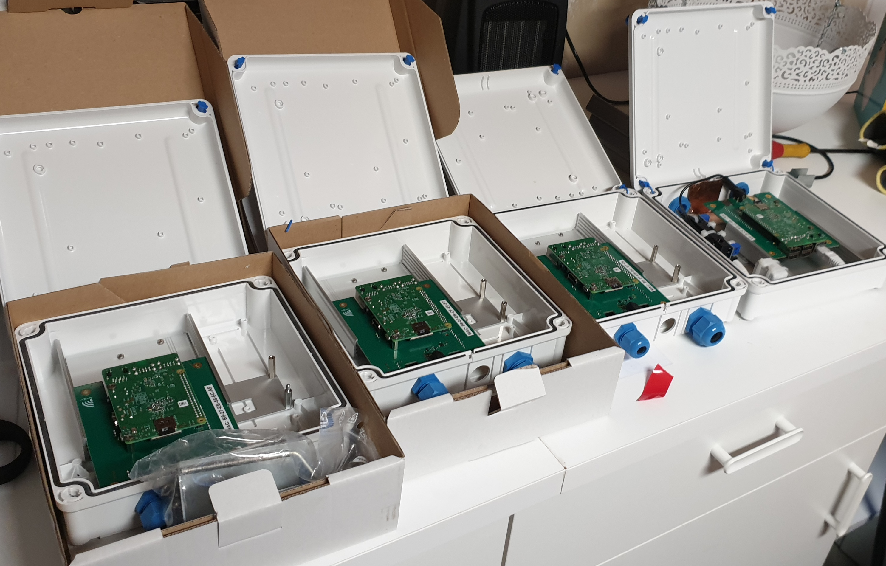

# IMST Lite Gateway



## Démarrer la Passerelle

Pour retrouver l'IP de la passerelle sur le réseau local (à adapter) :

```
 nmap -sn 192.168.0.0/24
```

S'y connecter avec ssh :

```
 ssh pi@192.168.0.34
```

Choisir un numéro d'ID pour la passerelle. Pour le moment, on prendra le code_postal suivi de zéros et du numéro de la passerelle. Ce qui donne pour la passerelle "1" dans le 31000 :

```
 3150000000000001
```

Pour effectuer le réglage, vu que le système est en lecture seule dans la RAM :

* lancer le script `~/enableWriteAccess.sh`
* modifier le champ `gateway_ID` dans le fichier ~/github/packet_forwarder/lora_pkt_fwd/local_conf.json
* vérifier que le champ `server_address` (ligne 203) dans `~/github/packet_forwarder/lora_pkt_fwd/global_conf.json` soit bien `loraserver.tetaneutral.net`
* lancer le script `~/disableWriteAccess.sh`

Lancer le packet_forwarder :

```
 cd ~/github/packet_forwarder/lora_pkt_fwd
 ./lora_pkt_fwd
```

!!! tip
    Le "packet-forwarder" implémente un protocole UDP entre la passerelle et le serveur. C'est un protocole normalisé par la LoRa Alliance et distribué par Semtech : https://github.com/Lora-net/packet_forwarder

    Ensuite sur le serveur http://loraserver.tetaneutral.net, "LoRa Gateway Bridge" qui transforme ce protocole en trames MQTT.

    Ce que l'on reçoit à la fin est un JSON avec des informations dont la payload en hexastring ou en base64.


!!! warning
    Sur Raspberry 3, il faut faire plusieurs tentatives afin qu'il démarre (soucis de fréquence du bus SPI à régler).


On devrait avoir :

```
pi@LoRagw04:~/github/packet_forwarder/lora_pkt_fwd $ ./lora_pkt_fwd
*** Beacon Packet Forwarder for Lora Gateway ***
Version: 3.1.0
*** Lora concentrator HAL library version info ***
Version: 4.1.3;
***
INFO: Little endian host
INFO: found global configuration file global_conf.json, parsing it
INFO: global_conf.json does contain a JSON object named SX1301_conf, parsing SX1301 parameters
INFO: lorawan_public 1, clksrc 1

....

JSON up: {"rxpk":[{"tmst":16563715,"chan":1,"rfch":1,"freq":868.300000,"stat":1,"modu":"LORA","datr":"SF7BW125","codr":"4/5","lsnr":9.8,"rssi":-101,"size":17,"data":"QAEA/wOAFAABbDYdLP4dtcM="}]}
INFO: [up] PUSH_ACK received in 32 ms
INFO: [down] PULL_ACK received in 30 ms

INFO: Received pkt from mote: 03FF0001 (fcnt=21)

JSON up: {"rxpk":[{"tmst":28840059,"chan":2,"rfch":1,"freq":868.500000,"stat":1,"modu":"LORA","datr":"SF7BW125","codr":"4/5","lsnr":7.0,"rssi":-95,"size":17,"data":"QAEA/wOAFQAB3kyKpuYSOmU="}]}
INFO: [up] PUSH_ACK received in 32 ms

##### 2018-04-14 20:18:50 GMT #####
### [UPSTREAM] ###
# RF packets received by concentrator: 4
# CRC_OK: 75.00%, CRC_FAIL: 25.00%, NO_CRC: 0.00%
```

La passerelle envoie périodiquement des trames avec des statistiques comme celle-ci :

```
 JSON up: {"stat":{"time":"2018-05-02 21:31:08 GMT","rxnb":1,"rxok":0,"rxfw":0,"ackr":100.0,"dwnb":0,"txnb":0}}
```

Le serveur lora les récupère et les renvoie en MQTT (voir plus bas)

## Ajouter la passerelle sur loraserver

Se connecter sur : [https://loraserver.tetaneutral.net/](https://loraserver.tetaneutral.net/)

!!! tip
    ```
    ssh root@loraserver.tetaneutral.net -p2222
    ```

    Voir install.txt avec la procédure d'installation de la plateforme. Infos de connexion aux lignes 66 et 67.

Dans organization/tetaneutral, créer une nouvelle passerelle. Récupérez la `gateway_ID` saisie dans le fichier `local_conf.json` pour le champ MAC sur loraserver.

On la trouve aussi dans les messages d'informations obtenus lors du lancement du "packet forwarder". Prendre la dernière `gateway MAC address` affichée :

```
    gateway MAC address is configured to AA555A0000000101
```

Prendre le choix par défaut pour le "network server".

## MQTT

On peut vérifier que tout fonctionne en s'abonnant au topic stats du flux MQTT publié par le serveur lora. Il faut une version de mosquitto_sub supérieure à 1.4.14.

Pour s'abonner à tous les topics :

```
 mosquitto_sub -h loraserver.tetaneutral.net -v -t "#"
```

### gateway/+/stats

Pour s'abonner à la couche physique et n'avoir que le topic stats de la passerelle dont on précise l'adresse MAC :

```
 mosquitto_sub -h loraserver.tetaneutral.net -v -t "gateway/aa555a0000000101/stats"
```

On devrait voir s'afficher :

```
 gateway/aa555a0000000101/stats
{"mac":"ab555a0000000101","time":"2018-06-04T14:57:41Z","rxPacketsReceived":2,"rxPacketsReceivedOK":1,"txPacketsReceived":0,"txPacketsEmitted":0}
```

Ce qui signifie :

* rxPacketsReceived : nombre de paquets LoRaWAN reçus
* rxPacketsReceivedOK : nombre de paquets LoRaWAN valides reçus (y compris ceux venant d'autres objets d'un autre réseau)
* txPacketsReceived : nombre de paquets émis de la passerelle vers l'objet (dans le cas où l'objet demande un acquitement)

### gateway/+/rx

Indique qu'un paquet LoRa valide a été reçu par la passerelle. Ici, comme on est toujours abonné à la couche physique, on sait pas à ce stade si c'est un paquet LoRaWAN.

```
 gateway/3150000000000001/rx
{"rxInfo":{"mac":"3150000000000001","timestamp":1925085275,"frequency":868100000,"channel":0,"rfChain":1,"crcStatus":1,"codeRate":"4/5","rssi":-61,"loRaSNR":9.2,"size":15,"dataRate":{"modulation":"LORA","spreadFactor":7,"bandwidth":125},"board":0,"antenna":0},"phyPayload":"QEBgMQaAAAABT7C8PcJV"}
```

La `payload` contient les données transmises (chiffrées en AES dans le cas d'un paquet LoRaWAN).

### gateway/+/tx

Ici le serveur loraserver accuse réception en confirmant que c'est bien un paquet LoRaWAN valide et qu'en plus il correspond à un objet enregistré. Le serveur ajouté un numéro (`token`, ici 64069)

```
 gateway/3150000000000001/tx
{"token":64069,"txInfo":{"mac":"3150000000000001","immediately":false,"timestamp":1926085275,"frequency":868100000,"power":14,"dataRate":{"modulation":"LORA","spreadFactor":7,"bandwidth":125},"codeRate":"4/5","iPol":null,"board":0,"antenna":0},"phyPayload":"YEBgMQaFAAADUgcAAf5QqLo="}
```

La `payload` contient ici l'accusé de réception (ACK).

### gateway/+/ack

Ici, la passerelle confirme au loraserver que c'est bien elle qui envoyée la trame identifiée par le `token`. En pratique c'est plutôt que la passerelle a bien mis cette trame dans sa file d'attente d'envois.
