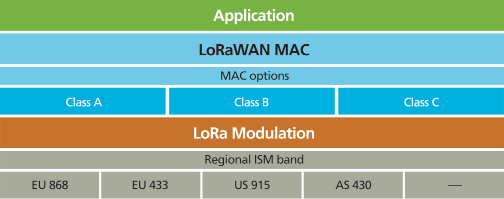
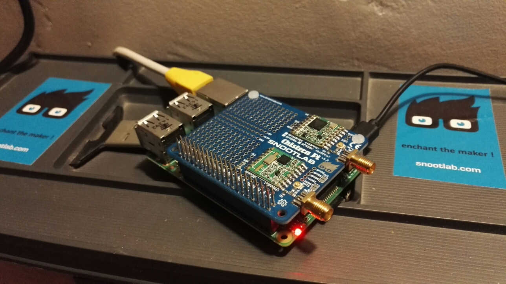

# LoRA, LoRAWAN, qu'est ce ? Quels matériels ?

## Généralités : LoRa, LoRaWAN ?

LoRa (_Long Range_) est une technologie radio permettant à des équipements de transmettre des informations sans fil. C'est avant tout une technique de modulation radio. Elle est basée sur une modulation à étalement de spectre (CSS). Le brevet de cette technologie appartient désormais à la société Semtech (Californie) suite au rachat en 2012 de la société grenobloise, Cycléo, qui l'avait déposé.

LoRaWAN™ est un protocole  _Low Power Wide Area Network (LPWAN)_ pour les objets connectés sans fils sur batterie dans un réseau régional, national ou mondial. LoRaWAN permet de la communication bi-directionnelle sécurisée (chiffrement AES128) ainsi que de la localisation.

Voir : [http://www.atim.com/fr/technologies/lorawan/](http://www.atim.com/fr/technologies/lorawan/)

### Protocole lorawan

Plus d'informations sur le protocole : [https://lora-alliance.org/lorawan-for-developers](https://lora-alliance.org/lorawan-for-developers)

## Réseaux LoRaWAN

Il existe différents réseaux loRaWAN maintenu par des opérateurs :

* Bouygues avec Objenious. C'est un réseau LoRa avec 4300 antennes déployées au 01/09/2017. Ils proposent aussi tout un ensemble de capteurs. Par exemple un capteur de température pouvant tenir 5 ans avec 3 émissions par jour.

    !!! Info
        Capteur GreenMe qui mesure de la qualité de l’environnement de travail : CO2, Humidité, Humidité air, Luminosité, Mouvement (accéléromètre), Niveau de luminosité, Pluie, Température, Bruit

        Afin de pouvoir mesurer en continu, chaque cube doit être connecté au secteur ou à une prise USB. Les données sont transmises sans fil (LoRa), par l'intermédiaire d'une box installée dans les locaux.

        [http://objenious.com/produit/greenme/](http://objenious.com/produit/greenme/)

    Ils proposent une plateforme SPOT (Smart Portal of Things) pour "Visualisez et analysez les données métiers remontées par vos capteurs indépendamment des réseaux utilisés et monitorez votre activité"

* Orange propose aussi un réseau LoRa :
[https://partner.orange.com/](https://partner.orange.com/)
[https://liveobjects.orange-business.com/#/liveobjects](https://liveobjects.orange-business.com/#/liveobjects)

* The Things Network est un réseau communautaire qui se veut "open-source" et décentralisé. Apparemment 7 gateways sur Toulouse : [https://www.thethingsnetwork.org/community/toulouse/](https://www.thethingsnetwork.org/community/toulouse/)

### Notre réseau

Le but de notre projet est de créer une extension du projet et de la philosophie de tetaneutral à l'internet des objets.

Il y a dans ce projet une portée pédagogique importante avec l'intérêt de plusieurs enseignants et établissements de la région.

Nous avons décider de scinder l'architecture en deux :

- Une plateforme data qui accueille une base de donnée et une application web type grafana afin de les visualiser simplement.

- Un serveur de réseau LoRaWAN afin de centraliser les flux de données qui proviennent des gateways et de les enregistrer sur la plateforme data.

L'idée est d'avoir plusieurs gateways chez des adhérents ou dans des établissements afin d'avoir une couverture assez large, ce qui est facilité par le fait que la technologie LoRaWAN est longue portée (~2km en ville).

## Logiciels

Pour les cartes type Arduino (WiNos, Feather M0...), nous utiliserons LMIC. IBM LMIC (LoRaMAC-in-C) est une librairie haut niveau qui fournit une implémentation complète de LoRaWAN classe A et B et qui fonctionne sur les bandes EU-868 et US-915.

[https://github.com/matthijskooijman/arduino-lmic](https://github.com/matthijskooijman/arduino-lmic)

## Matériels pour passerelles LoRaWAN

### Chistera-Pi

La ChisteraPi est une carte d'extension pour RaspberryPi qui permet de mettre en oeuvre de nombreux protocoles grâce à ses deux transmetteurs qui permettent d'émettre dans les deux bandes ISM (433MHz et 868MHz).

La ChisteraPi ne permet que de faire du *mono-canal* mais cela peut être suffisant. Si vous dépassez plusieurs dizaines d'objets connectés, il faudra envisager du multicanal...

### Lite-GW avec iC880A

LoRa Lite Gateway (LGW) est une plateforme de développement composée du concentrateur LoRa iC880A, d'un Raspberry Pi et d'une carte SD pré-configurée.

[https://shop.imst.de/wireless-modules/lora-products/36/lite-gateway-demonstration-platform-for-lora-technology](https://shop.imst.de/wireless-modules/lora-products/36/lite-gateway-demonstration-platform-for-lora-technology)

## Matériels pour objets

### Feather M0 LoRa 900Mhz

Le Feather M0 embarque un processeur ARM Cortex M0 à 48 MHz. Le même que sur la Arduino Zero. Le module LoRa est un SX127x avec interface SPI.

[https://www.adafruit.com/product/3178](https://www.adafruit.com/product/3178)

Il n'y a pas d'antenne mais il suffit d'un fil pour faire une "quarter wave whip antenna". Il suffit de couper le fil à la bonne longueur :

* 433 MHz - 16.5 cm
* 868 MHz - 8.2 cm
* 915 MHz - 7.8 cm

### WiNo v2 aka Yah!

À venir car en cours de tests...
